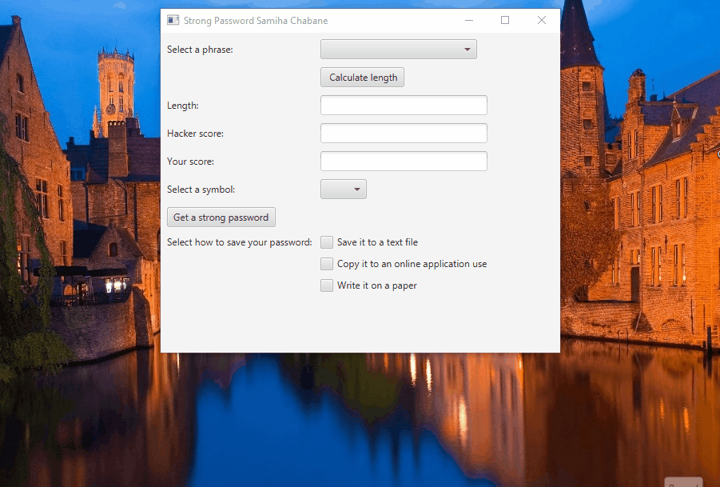

# JavaFX Strong Password Generator

## Overview

This JavaFX application helps users generate strong, memorable passwords based on a selected phrase and special symbol. The app also displays the password's length and estimates its strength against hacking attempts. Users can choose to save the password on paper or export it to a `.txt` file.

## Features

- 🔐 **Password Generation** based on user-selected phrases and symbols
- 📏 **Password Length Display**
- 🧠 **Password Strength Estimation** against brute-force attacks
- 💾 **Save to Text File** option
- 🖥️ **Clean and Intuitive JavaFX GUI**

## How It Works

1. **Select a Phrase**: Choose a memorable phrase from a predefined list.
2. **Select a Special Symbol**: Pick a symbol to enhance the complexity.
3. **Generate Password**: Click the generate button to create a strong password.
4. **View Details**: See the password, its length, and an estimated strength rating.
5. **Save or Print**: Choose to save the password to a `.txt` file or copy it for an online application use.

## Technologies Used

- Java 11+
- JavaFX
- Maven or Gradle (optional for building)
- Java IO for file operations

## Setup Instructions

### Prerequisites

- Java JDK 11 or later
- JavaFX SDK (if not bundled with your IDE)
- An IDE like IntelliJ IDEA, Apache NetBeans, or VS Code with Java support

### Running the App

1. Clone or download this repository.
2. Open the project in your IDE.
3. Make sure JavaFX is properly set up in your environment.
4. Run the `Password.java` class.

### Example Password Generation Logic

The password might be generated using a combination of:
- The selected phrase
- The selected symbol (e.g., "@")
- A randomly included digit

### Estimating Password Strength

Password strength is calculated based on:
- Length of the password
- Use of upper/lowercase letters, numbers, and special symbols

Strength Levels: 0 or 1

## Saving the Password

- The user can choose to save the password in a plain `StrongPassword.txt` file.
- The file will be saved in a default or user-specified location.

## Future Improvements

- Allow custom phrase input
- Add more symbols and phrase categories
- Enhanced entropy-based strength estimation
- Integration with a secure password manager

## 🎬 Demo

## License

This project is open-source. You can modify and use it freely for personal or educational purposes.

---
